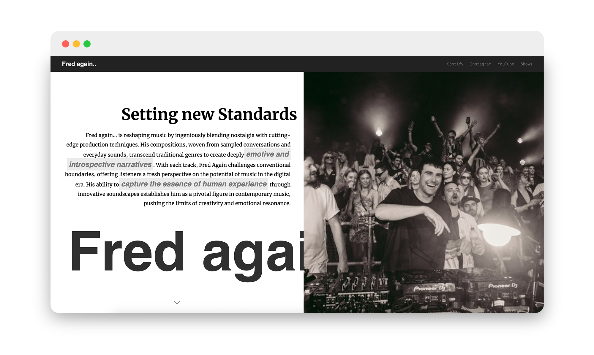
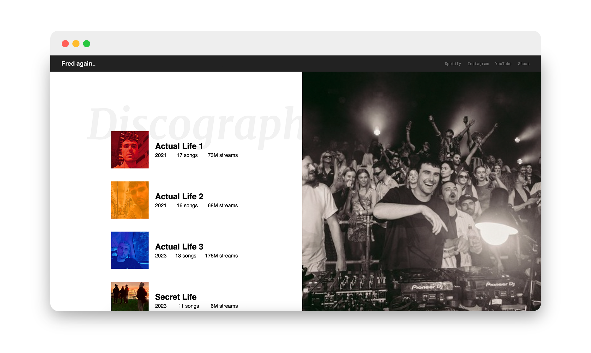

# freeCodeCamp Project 02: Tribute Website

The second <b>freeCodeCamp Responsive Web Design Program</b> project tasks me with creating a tribute landing page to showcase something I am passionate about. I employed modern layout techniques like flexbox and CSS grid, I organized content efficiently, particularly in the discography section where album details are presented in a structured and visually appealing manner. Utilizing external fonts from Google Fonts, I enhanced typography choices to complement the page’s design, balancing readability and style. I also integrated links to Fred again..'s Spotify, Instagram, YouTube, and upcoming shows, enhancing user engagement and connectivity with his broader online presence. Implementing @media queries, I ensured the page adapts seamlessly from large desktop screens to mobile devices, providing a consistent user experience.

 
Designed and implemented visual elements such as album covers and artist imagery to evoke the essence of Fred again..'s creative vision, enhancing the overall thematic coherence of the tribute page.

 
Note: This project serves as a testament to my dedication to web development and my admiration for Fred again..'s artistry. It reflects ongoing learning and improvement in both technical proficiency and creative expression.

  

Scrolled down a little bit (only the left flexbox item scrolls):

  

<h3>html Concepts Applied
</h3>

- flexbox, flex-direction
- justify-content
- align-items
- display: block
- container, div nesting
- header
- nav bar
- overflow and wrapping styling
- importing fonts
- typography and font styling

